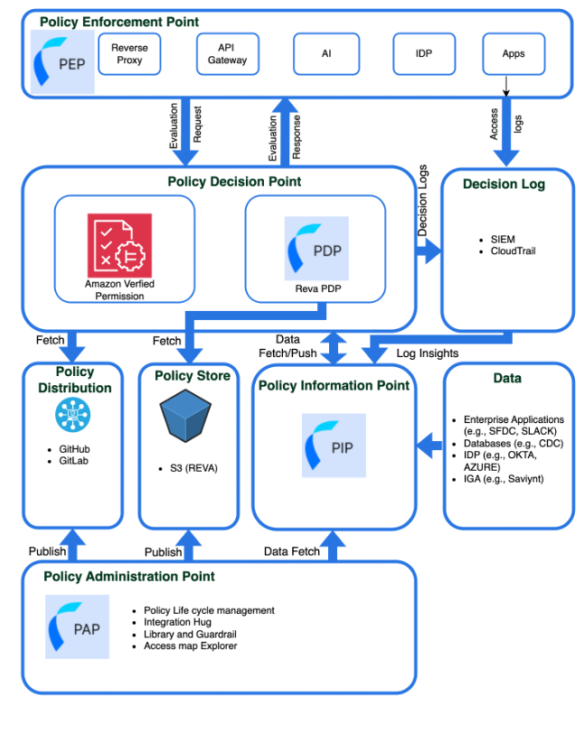

# Architecture Overview: Core Components and Enabling Components

The architecture diagram represents the Reva Governance and Authorization Platform, designed to enforce fine-grained, scalable, and auditable access control across distributed environments. The platform follows a modular structure, separating concerns between policy administration, decision-making, information retrieval, enforcement, and auditing. The platform ensures that authorization decisions are made dynamically by evaluating real-time context and up-to-date policies while maintaining a complete record of every access decision.

  
*Figure: Reva Governance and Authorization Platform Architecture*

## Core Components

These are the primary building blocks of the Reva Governance and Authorization Platform. They directly drive policy management, enforcement, decision-making, and dynamic information retrieval.

### Policy Administration Point (PAP):

The PAP is the interface where administrators define, create, update, and manage policies. It provides workflows for policy design, approval, and version control. Once policies are authored and reviewed, they are published and distributed to enforcement and decision-making systems.

### Policy Enforcement Point (PEP):

The PEP acts as the gatekeeper between users/applications and the protected resources. It intercepts incoming access requests and forwards them to the PDP for evaluation. Based on the PDP’s decision, the PEP allows or denies the request, enforcing security policies in real-time.

### Policy Decision Point (PDP):

The PDP is responsible for making access decisions. It evaluates incoming requests against active policies retrieved from the Policy Store and gathers any additional context from the PIP. The PDP determines whether access should be permitted or denied, returning this result to the PEP.

### Policy Information Point (PIP):

The PIP supplies dynamic, context-aware information to the PDP during evaluations. It connects to external data sources to retrieve real-time attributes such as user roles, device posture, location, and environmental conditions, enabling fine-grained and conditional access control.

## Reva’s Access Map:

Reva’s Access Map provides a powerful visual representation of authorization relationships based on the Cedar schema and associated test data. It maps how Principals (such as users or roles) are allowed to perform specific Actions on various Resources. The Access Map offers administrators a dynamic and intuitive way to explore access permissions within the system.

Administrators can easily filter and search the Access Map to answer questions like, "What access does Bob have?" using two modes: AI-powered Natural Language Processing (NLP) and Reva Query Language (RQL). These advanced filtering capabilities make it effortless to pinpoint permissions, uncover gaps, and validate policy designs — ensuring that access governance is both transparent and easy to manage.

### Key Features:

- Graphical Mapping: Displays how users (Principals) are allowed to perform actions on resources.
- Natural Language Filtering: Administrators can query the map using simple, AI-powered natural language (e.g., “What access does Bob have?”).
- Reva Query Language (RQL): Advanced filtering can be performed using structured queries.
- Governance Validation: The Access Map helps identify gaps, overlaps, and conflicts in access policies, supporting better governance and auditing.
- Real-Time Synchronization: As policies and schemas evolve, the Access Map updates dynamically to reflect the latest structure.

## Enabling Components

These components assist the core components by storing policies, distributing updates, maintaining logs, and sourcing external data.

### Policy Stores:

A centralized repository where all defined policies are securely stored. The PDP retrieves policies from here during evaluations.

### Policy Distribution:

Facilitates the delivery of updated or newly created policies from the PAP to the Policy Store and PDPs across the system.

### Decision Logs:

Captures all access decisions made by the PDP, including contextual information, for auditing, monitoring, and compliance reporting.

### Data Sources:

External systems (e.g., identity providers, databases) connected via the PIP to provide necessary attribute information for runtime decision-making.
